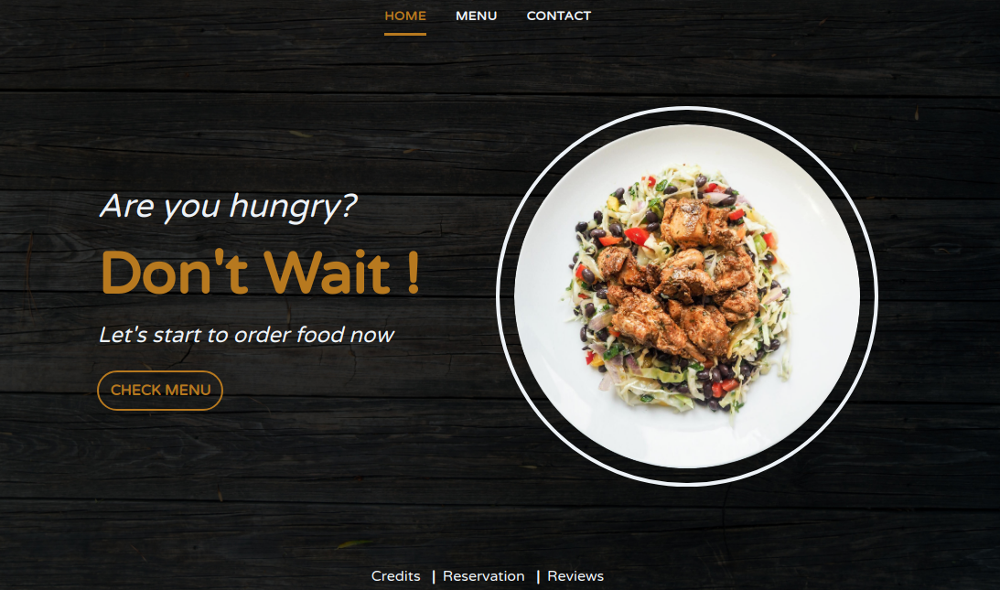

# Restaurant

## :memo: :heavy_check_mark: Restaurant Page
> A javascript powered restaurant page. [Live]()

#### Installation:
```
git clone git@github.com:mosaaleb/restaurant.git
cd restaurant
npm install

# To build the app for production, run the following command:
npm run build-prod
```

#### Description
Implementation of restaurant page with multiple tabs rendering using javascript

#### UI Inspiration
[Go](https://dribbble.com/shots/6764812-Concept-of-website-restaurant-design)

#### Tech Used: 
- [webpack](https://webpack.js.org/)
- [tailwindcss](https://tailwindcss.com/)

#### Author:
- [Muhammad](https://github.com/mosaaleb)
